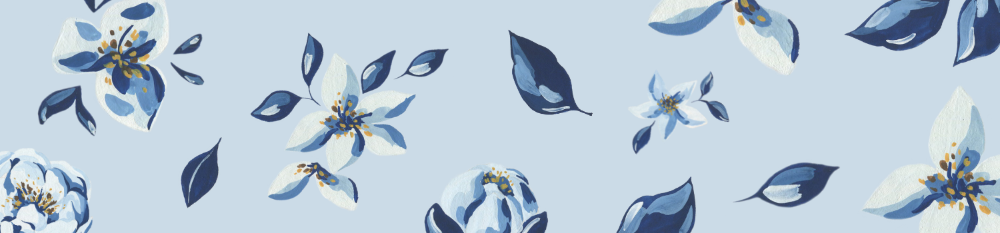
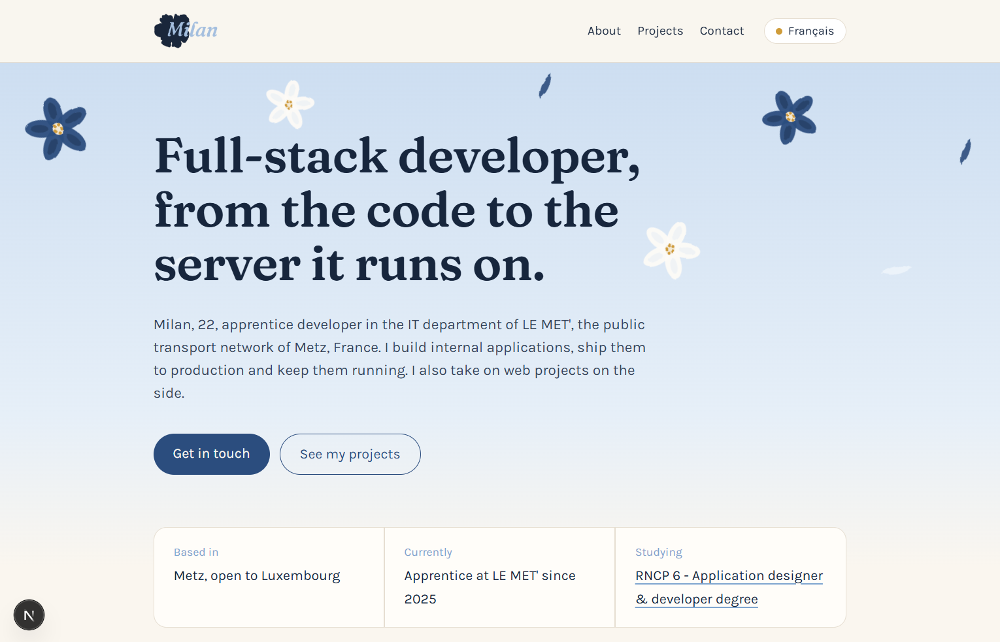
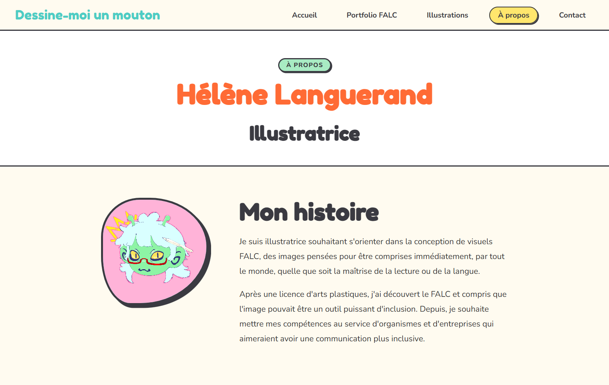
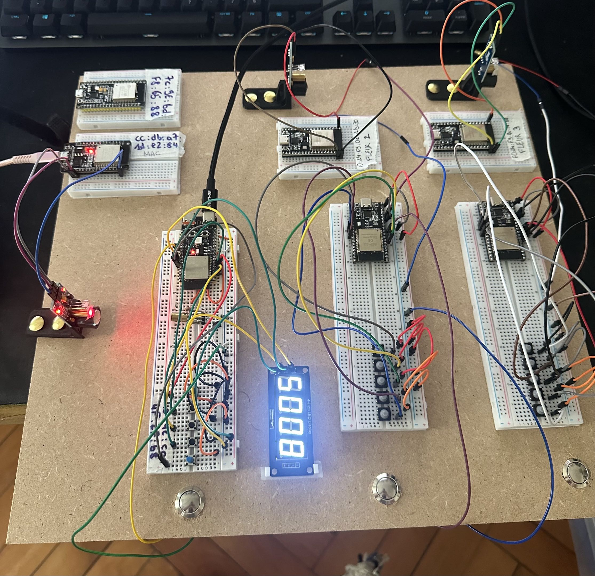

# 👋 Welcome to Milan's place

Hi! I'm a full-stack developer at the public transport network of Metz, currently preparing the [RNCP 6](https://www.francecompetences.fr/recherche/rncp/37873/) CDA certification with ESTIAM school.  
I work across dev, infrastructure and system administration: from building internal tools to running the servers they live on.  
I also worked with microcontroller units, in arduino and micropython.

You can reach me [there](https://www.linkedin.com/in/milan-remy-3458a6295/), send me a [mail](mailto:mremy-dev@gmail.com), or check [my website](https://mremy-dev.fr)!

- 👤 22 years old
- 🌱 Currently working as an apprentice Full-stack developer at LE MET' in Metz
- ⚡ Fun fact: big fan of the Inazuma Eleven franchise

### 🛠️ Languages and Tools:

### 🐉 Projects:

<table>
<tr>
<td width="35%"></td>
<td>

**[My website](https://github.com/nakzskea/portfolio-milan)** [(link)](https://mremy-dev.fr) — *Personal project · 2026*

Personal portfolio site with a presentation/skills page, a projects showcase and a contact page.

`Next.JS` `Tailwind` `TypeScript` `JavaScript`

</td>
</tr>
<tr>
<td width="35%"></td>
<td>

**[Dessine-moi un mouton](https://github.com/nakzskea/Site-LN)** [(link)] — *Client project · 2026*

Website built for an illustrator (my girlfriend 🤓), with a FALC portfolio, illustration gallery and contact form.

`HTML` `CSS` `JavaScript` `PHP`

</td>
</tr>
<tr>
<td width="35%"></td>
<td>

**[BeeAthlon](https://github.com/nakzskea/BeeAthlonBackup)** — *FabLab MDesign · 2025*

An ecological-themed laser biathlon project: electronics and a local web interface showing the readings.
Backup repository to explain how to use and edit the devices.

`Arduino` `C++` `MicroPython` `JavaScript`

</td>
</tr>
</table>
